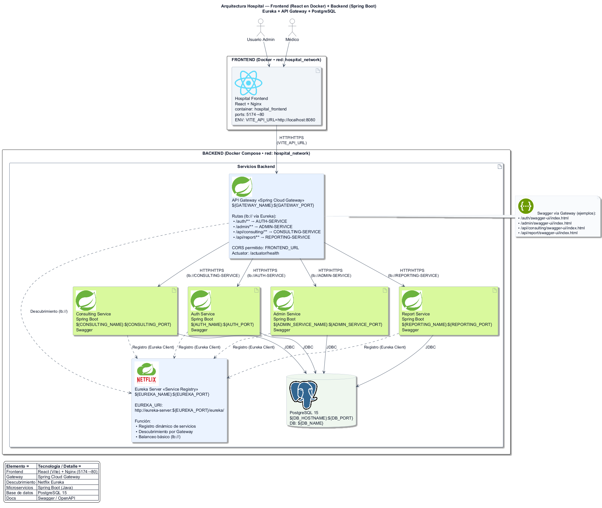

# Hospital Management System

Sistema de gestión hospitalaria basado en **microservicios**, desarrollado con **Spring Boot 3**, **Spring Cloud** (Gateway y Eureka) y autenticación con **JWT**. 

## Funcionalidades principales

El sistema cuenta con **autenticación centralizada** mediante el *Auth Service* (JWT), con todas las peticiones gestionadas por el **API Gateway**. La **descubierta de servicios** se maneja en **Eureka Server**, donde cada microservicio se registra automáticamente.

Microservicios principales:
- **Auth Service** → usuarios, login, registro y roles.
- **Administration Service** → doctores, especialidades y centros médicos.
- **Consulting Service** → pacientes y consultas médicas.
- **Reporting Service** → reportes y análisis.

Toda la información se almacena en una base de datos central **PostgreSQL** en contenedor.

**Nota:** cada microservicio cuenta con su propio `README.md` donde se documentan detalles específicos de configuración, endpoints y despliegue.

Para un mayor entendimiento de la API, visitar **Swagger**:  
[http://localhost:8080/swagger-ui/index.html#/](http://localhost:8080/swagger-ui/index.html#/)

## Stack Tecnológico

| Categoría         | Tecnologías utilizadas                                                                 |
|-------------------|-----------------------------------------------------------------------------------------|
| Lenguaje          | Java 17                                                                                |
| Framework         | Spring Boot 3.5.x                                                                      |
| Seguridad         | Spring Security (JWT)                                                                  |
| Integración       | Spring Cloud Gateway, Netflix Eureka (Service Discovery)                               |
| Persistencia      | Spring Data JPA                                                                        |
| Base de datos     | PostgreSQL 15                                                                          |
| Construcción      | Maven                                                                                  |
| Contenedores      | Docker, Docker Compose                                                                 |
| Frontend          | React (Vite) + Nginx                                                                   |
| Documentación API | Swagger / OpenAPI                                                                      |

## Estructura del proyecto

La carpeta raíz `hospital-system-parent/` actúa como proyecto padre para dependencias comunes.  
Dentro se organizan los **microservicios hijos**: Eureka, Gateway, Auth, Admin, Consulting y Reporting.

```text
hospital-system-parent/
├── hospital-eureka-server   # Registro y descubrimiento de servicios
├── hospital-gateway         # Puerta de entrada (enrutamiento y seguridad)
├── auth-service             # Autenticación, registro de usuarios y emisión de JWT
├── admin-service            # Gestión de usuarios, doctores y centros médicos
├── consulting-service       # Administración de consultas médicas
└── reporting-service        # Generación de reportes y análisis
```

## Arquitectura

La aplicación está compuesta por **microservicios en contenedores Docker**, conectados en una red interna común.

- **Frontend** en **React + Nginx**.
- **API Gateway (Spring Cloud Gateway)** para enrutar peticiones y aplicar seguridad.
- **Eureka Server** para registro y descubrimiento de servicios (`lb://`).
- Microservicios en **Spring Boot**:
    - *Auth Service* → autenticación y JWT.
    - *Admin Service* → gestión administrativa.
    - *Consulting Service* → consultas médicas.
    - *Report Service* → reportes y análisis.
- Base de datos central en **PostgreSQL**.

A continuación, se muestra el diagrama general de la arquitectura:


  


## Gateway y Documentación de APIs

El **API Gateway** centraliza todo el tráfico y aplica validaciones de seguridad.  
Las rutas están definidas con prefijos claros para cada microservicio:

- `/auth/**` → Auth Service
- `/admin/**` → Administration Service
- `/api/consulting/**` → Consulting Service
- `/api/report/**` → Reporting Service

El gateway expone un **CORS global** que permite el consumo desde el `FRONTEND_URL` configurado en las variables de entorno.

### Documentación de APIs
Cada microservicio publica su especificación **OpenAPI/Swagger**.  
El gateway reescribe las rutas de `/v3/api-docs` y agrupa todas en un único Swagger UI accesible desde:

👉 [http://localhost:8080/swagger-ui/index.html#/](http://localhost:8080/swagger-ui/index.html#/)

Documentación por servicio vía Gateway:
- **Auth Service:** `/auth/v3/api-docs`
- **Administration Service:** `/admin/v3/api-docs`
- **Consulting Service:** `/api/consulting/v3/api-docs`
- **Reporting Service:** `/api/report/v3/api-docs`


## Despliegue con Docker

### 1. Preparar variables de entorno
Copia el archivo de ejemplo y **ajusta los valores según tus necesidades** (p. ej., `MAIL_PASSWORD`, `SECRET_KEY`, puertos, etc.).

**Linux/macOS:**
```bash
cp .example.docker.env .env
```
**Windows (PowerShell):**

```bash
Copy-Item .example.docker.env .env
```

### 2. Construir e iniciar el stack
Ejecuta desde la carpeta raíz del proyecto padre:

```bash
docker compose -f docker-compose-prod.yml --build
docker compose -f docker-compose-prod.yml up -d
```

### 3. Verificación rápida
Confirma que los contenedores estén corriendo y revisa el estado del gateway:

```bash
docker compose ps
docker compose logs -f hospital-gateway
```
**URLs útiles**
- **Eureka Dashboard:** http://localhost:8761
- **Gateway Health:** http://localhost:8080/actuator/health
- **Swagger (vía Gateway):** http://localhost:8080/swagger-ui/index.html#/
- **PostgreSQL:** localhost:5432 · Base de datos `hospital_system`

### 4. Detener y limpiar

Para detener los servicios o limpiar el entorno, utiliza los siguientes comandos:

```bash
docker compose down                # detener todos los contenedores
docker compose down -v             # detener y eliminar volúmenes (⚠️ borra datos de la DB)
docker image prune -f              # limpiar imágenes huérfanas
```
### 5. Problemas comunes

- **401 tras login** → revisa que `SECRET_KEY` sea el mismo en todos los servicios y que la hora del sistema esté sincronizada.
- **404 vía Gateway** → confirma que el servicio esté registrado en **Eureka** y que uses el prefijo correcto (`/auth`, `/admin`, `/api/consulting`, `/api/report`).
- **Error de CORS** → asegúrate de que `FRONTEND_URL` en el `.env` coincida con la URL real del frontend.
- **Conexión a la base de datos** → desde los contenedores el host debe ser `hospital-db` (no `localhost`).  


## Persistencia y datos

El sistema utiliza **PostgreSQL** como base de datos central, ejecutada en contenedor Docker y con persistencia habilitada mediante volúmenes.

**Volumen principal:**  
  El `docker-compose.yml` define `hospital_data`, montado en `/var/lib/postgresql/data`.  
  Este volumen garantiza que los datos se conserven aunque los contenedores se detengan o se reconstruyan.
  > ⚠️ Solo se elimina con `docker compose down -v`, lo cual borra todos los datos.

**Seeds de datos:**  
  El archivo `init.sql` en la raíz se monta automáticamente en `/docker-entrypoint-initdb.d/` y se ejecuta **únicamente la primera vez** que se crea el volumen.  
  Para re-aplicarlo es necesario eliminar el volumen y volver a levantar los contenedores:
  ```bash
  docker compose down -v
  docker compose up -d
```

**Backups y restauración**

Puedes generar y restaurar respaldos de la base de datos PostgreSQL directamente desde el contenedor:

```bash
# Crear backup
docker exec -t hospital-db pg_dump -U ${DB_USERNAME} ${DB_NAME} > backup.sql

# Restaurar backup
cat backup.sql | docker exec -i hospital-db psql -U ${DB_USERNAME} -d ${DB_NAME}
```